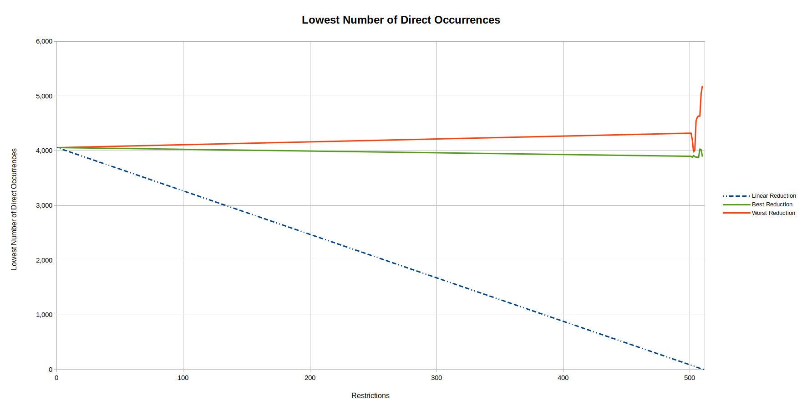

# Results

The results of this project can be measured using different indicators. The
sections below give an overview of the project using the total complexity of
the function, the number of operations in the function and the number of
assignments.

## Lowest Number of Direct Occurrences

The number of direct occurrences is measured as the number of times an input bit
occurs directly in an expression in the calculation. If an input bit has been
eliminated from the calculation of the output bits, a collission has been found
as the result of the function will be the same regardless of the value of the
eliminiated input bit. In that case, its number of direct occurrences will have
been reduced to zero.

The performance of the project can be benchmarked against a linear reduction of
the lowest number of direct occurrences, starting from the lowest number of
direct occurrences for the situation where no input bit has been fixed, to a
value of 0 for 511 input bits fixed.

Results better than the linear reduction are marked in bold.

| Restrictions | Linear Reduction | Best Reduction | Best Restriction |
|:------------:|:----------------:|:--------------:| ---------------- |
|       0      | 4,060            | 4,060          | [Initial Situation](000/000.md) |
|       1      | 4,052            | 4,060          | Many             |

## Number of Direct Occurrences

The number of direct occurrences is measured as the number of times an input bit
occurs directly in an expression in the calculation. When all input bits have
been fixed, the number of direct occurrences will have been reduced to zero.

A reduction of the number of direct occurrences may give an indication that the
project is approaching a collision, and if the number of direct occurrences is
reduced to zero without all input bits being fixed, a collision has indeed been
found. However, it can be expected that if this project will find a collision,
the collision will be found long before the number of direct occurrences has
been reduced to zero. Also, a large reduction in the number of direct
occurrences doesn't guarantee that a collision will be found: as long as every
input bit remains present at least once in the calculation of an output bit, a
collision has not been found.

The performance of the project can be benchmarked against a linear reduction of
the number of direct occurrences, starting from the number of direct occurrences
for the situation where no input bit has been fixed, to a value of 0 for 511
input bits fixed.

Results better than the linear reduction are marked in bold.

| Restrictions | Linear Reduction | Best Reduction | Best Restriction |
|:------------:|:----------------:|:--------------:| ---------------- |
|       0      | 2,284,316        | 2,284,316      | [Initial Situation](000/000.md) |
|       1      | 2,279,846        | **2,278,210**  | [O031032](001/o031032.md) |

## Complexity of the Least Complex Input Bit

The complexity of an input bit is calculated as the number of times it appears
in the calculation of an output bit. If an input bit has been eliminated from
the calculation of the output bits, a collission has been found as the result
of the function will be the same regardless of the value of the eliminiated
input bit. In that case, its complexity will have been reduced to zero.

The performance of the project can be benchmarked against an exponential
reduction of the complexity of the least complex input bit, starting from the
complexity of the least complex input bit for the situation where no input bit
has been fixed. The goal is to reduce this value to zero for 511 input bits
fixed. Notice however that the measured values will not necessarily relate to
the same input bit: a restriction may reduce the complexity of one input bit
below the complexity of the least complex input bit from the previous round.

Results better than the exponential reduction are marked in bold.

| Restrictions | Exponential Reduction | Best Reduction | Best Restriction |
|:------------:|:---------------------:|:--------------:| ---------------- |
|       0      | 2.62×10³²⁷            | 2.62×10³²⁷     | [Initial Situation](000/000.md) |
|       1      | 5.99×10³²⁶            | 2.62×10³²⁷     | Many             |

## Total Complexity

The complexity of the function is measured as the total number of times each
input bit appears in the calculation of an output bit. When all input bits
have been fixed, the total complexity will have been reduced to zero.

A reduction of the total complexity may give an indication that the project
is approaching a collision, and if the complexity is reduced to zero without
all input bits being fixed, a collision has indeed been found. However, it can
be expected that if this project will find a collision, the collision will be
found long before the total complexity has been reduced to zero. Also, a large
reduction in the total complexity doesn't guarantee that a collision will be
found: as long as every input bit remains present at least once in the
calculation of an output bit, a collision has not been found.

The performance of the project can be benchmarked against an exponential
reduction of the total complexity, starting from the total complexity for the
situation where no input bit has been fixed, to a value of 1 for 511 input bits
fixed. If a collision can be found, the total complexity will actually be
reduced to 0 for 511 input bits restricted.

Results better than the exponential reduction are marked in bold.

| Restrictions | Exponential Reduction | Best Reduction | Best Restriction |
|:------------:|:---------------------:|:--------------:| ---------------- |
|       0      | 2.61×10⁴⁰⁵            | 2.61×10⁴⁰⁵     | [Initial Situation](000/000.md) |
|       1      | 4.20×10⁴⁰⁴            | **1.57×10⁴⁰⁴** | [E031032](001/e031032.md) |

## Number of Operations

The number of operations is measured as the number of times the boolean
operators and (“&”), or (“|”) and xor (“^”) appear in the calculation. When all
input bits have been fixed, the number of operators will have been reduced to
zero.

A reduction of the number of operations may give an indication that the project
is approaching a collision, and if the number of operations is reduced to zero
without all input bits being fixed, a collision has indeed been found. However,
it can be expected that if this project will find a collision, the collision
will be found long before the number of operations has been reduced to zero.
Also, a large reduction in the number of operations doesn't guarantee that a
collision will be found: as long as every input bit remains present at least
once in the calculation of an output bit, a collision has not been found.

The performance of the project can be benchmarked against a linear reduction of
the number of operations, starting from the number of operations for the
situation where no input bit has been fixed, to a value of 0 for 511 input bits
fixed.

Results better than the linear reduction are marked in bold.

| Restrictions | Linear Reduction | Best Reduction | Best Restriction |
|:------------:|:----------------:|:--------------:| ---------------- |
|       0      | 25,954,167       | 25,954,167     | [Initial Situation](000/000.md) |
|       1      | 25,903,376       | **25,901,811** | [E031032](001/e031032.md) |

## Number of Assignments

The number of assignments is measured as the number of local variables used in
the calculation. When all input bits have been fixed, the number of assignments
will have been reduced to zero.

A reduction of the number of assignments may give an indication that the project
is approaching a collision, and if the number of assignments is reduced to zero
without all input bits being fixed, a collision has indeed been found. However,
it can be expected that if this project will find a collision, the collision
will be found long before the number of assignments has been reduced to zero.
Also, a large reduction in the number of assignments doesn't guarantee that a
collision will be found: as long as every input bit remains present at least
once in the calculation of an output bit, a collision has not been found.

The performance of the project can be benchmarked against a linear reduction of
the number of assignments, starting from the number of assignments for the
situation where no input bit has been fixed, to a value of 0 for 511 input bits
fixed.

Results better than the linear reduction are marked in bold.

| Restrictions | Linear Reduction | Best Reduction | Best Restriction |
|:------------:|:----------------:|:--------------:| ---------------- |
|       0      | 24,180           | 24,180         | [Initial Situation](000/000.md) |
|       1      | 24,133           | 24,166         | [E031032](001/e031032.md) |

