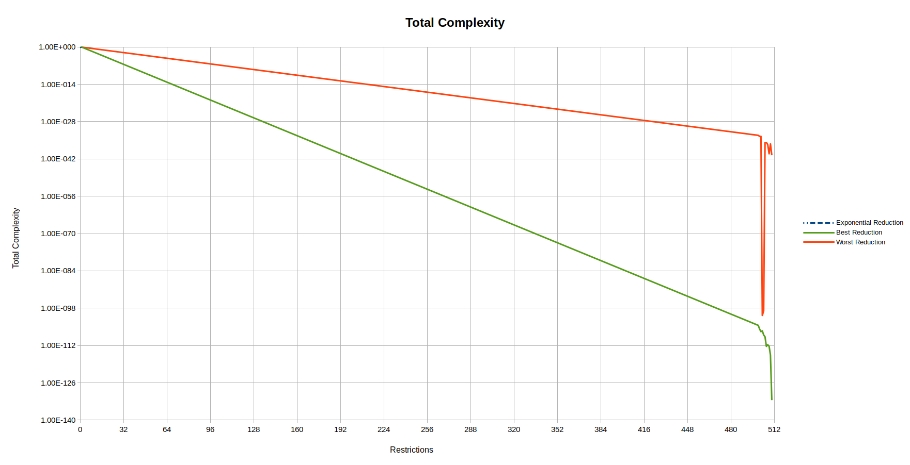

# Results

The results of this project can be measured using different indicators. The
sections below give an overview of the project using the total complexity of
the function, the number of operations in the function and the number of
assignments.

## Total Complexity

The complexity of the function is measured as the total number of times each
input bit appears in the calculation of an output bit. When all input bits
have been fixed, the total complexity will have been reduced to zero.

A reduction of the total complexity may give an indication that the project
is approaching a collision, and if the complexity is reduced to zero without
all input bits being fixed, a collision has indeed been found. However, it can
be expected that if this project will find a collision, the collision will be
found long before the total complexity has been reduced to zero. Also, a large
reduction in the total complexity doesn't guarantee that a collision will be
found: as long as every input bit remains present at least once in the
calculation of an output bit, a collision has not been found.

The performance of the project can be benchmarked against an exponential
reduction of the total complexity, starting from the total complexity for the
situation where no input bit has been fixed, to a value of 1 for 511 input bits
fixed. If a collision can be found, the total complexity will actually be
reduced to 0 for 511 input bits restricted.

Results better than the exponential reduction are marked in bold.

| Restrictions | Exponential Reduction | Best Reduction | Best Restriction |
|:------------:|:---------------------:|:--------------:| ---------------- |
|       0      | 1.00×10⁰              | 1.00×10⁰       | N/A              |
|       1      | 1.61×10⁻¹             | 3.64×10⁻¹      | F032             |
|       2      | 2.59×10⁻²             | **1.87×10⁻²**  | F031-F032        |
|       3      | 4.17×10⁻³             | 1.40×10⁻²      | T029-F031-F032   |
|       4      | 6.71×10⁻⁴             | 9.54×10⁻³      | F029-F030-F031-F032 |

## Number of Operations

The number of operations is measured as the number of times the boolean
operators and (“&”), or (“|”) and xor (“^”) appear in the calculation. When all
input bits have been fixed, the number of operators will have been reduced to
zero.

A reduction of the number of operations may give an indication that the project
is approaching a collision, and if the number of operations is reduced to zero
without all input bits being fixed, a collision has indeed been found. However,
it can be expected that if this project will find a collision, the collision
will be found long before the number of operations has been reduced to zero.
Also, a large reduction in the number of operations doesn't guarantee that a
collision will be found: as long as every input bit remains present at least
once in the calculation of an output bit, a collision has not been found.

The performance of the project can be benchmarked against a linear reduction of
the number of operations, starting from the number of operations for the
situation where no input bit has been fixed, to a value of 0 for 511 input bits
fixed.

Results better than the linear reduction are marked in bold.

| Restrictions | Linear Reduction | Best Reduction | Best Restriction |
|:------------:|:----------------:|:--------------:| ---------------- |
|       0      | 61,474           | 61,474         | N/A              |
|       1      | 61,354           | 61,448         | F032             |
|       2      | 61,233           | 61,424         | F031-F032        |
|       3      | 61,113           | 61,385         | T029-F031-F032   |
|       4      | 60,993           | 61,370         | F029-F030-F031-F032 |

## Number of Assignments

The number of assignments is measured as the number of local variables used in
the calculation. When all input bits have been fixed, the number of assginments
will have been reduced to zero.

A reduction of the number of assignments may give an indication that the project
is approaching a collision, and if the number of assignments is reduced to zero
without all input bits being fixed, a collision has indeed been found. However,
it can be expected that if this project will find a collision, the collision
will be found long before the number of assignments has been reduced to zero.
Also, a large reduction in the number of assignments doesn't guarantee that a
collision will be found: as long as every input bit remains present at least
once in the calculation of an output bit, a collision has not been found.

The performance of the project can be benchmarked against a linear reduction of
the number of assignments, starting from the number of assignments for the
situation where no input bit has been fixed, to a value of 0 for 511 input bits
fixed.

Results better than the linear reduction are marked in bold.

| Restrictions | Linear Reduction | Best Reduction | Best Restriction |
|:------------:|:----------------:|:--------------:| ---------------- |
|       0      | 24,523           | 24,523         | N/A              |
|       1      | 24,475           | 24,508         | F032             |
|       2      | 24,427           | 24,491         | F031-F032        |
|       3      | 24,379           | 24,458         | T029-F031-F032   |

